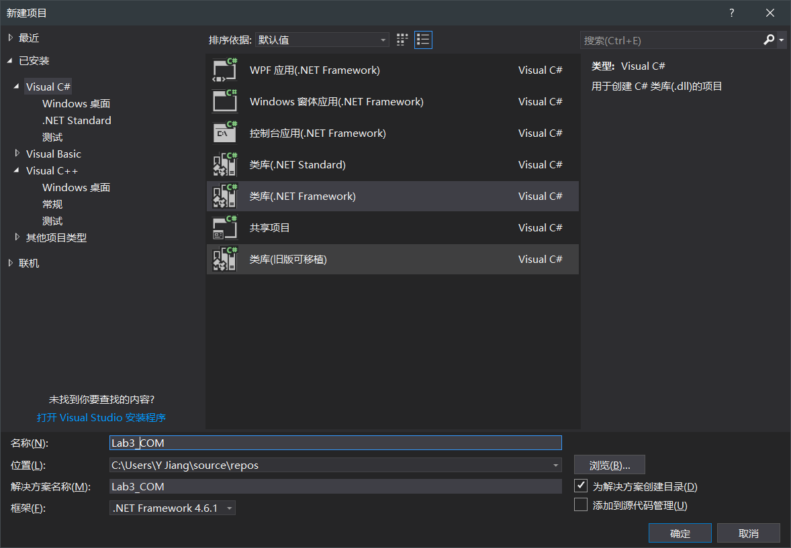
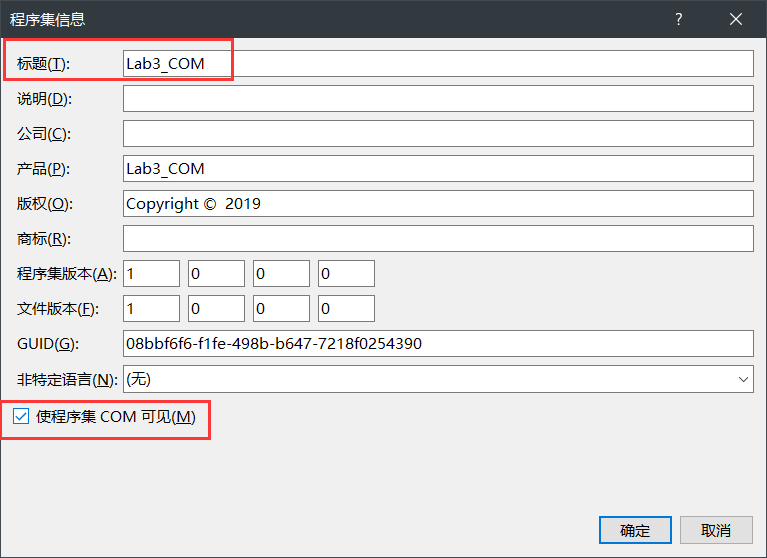

##中间件技术实验3：COM组件和调用

###一、引言

- **实验目的**

&emsp;&emsp;了解.NET Framwork、COM组件

- **实验内容**

&emsp;&emsp;构建一个com组件，该组件可以对一个字符串数组进行压缩和解压缩（压缩和解压算法自己定义，或者调用其他的库）；

###二、相关环境
- 操作系统：Windows10 X64
- IDE:     IDEA 2018.2.6 、 VS Studio 2017
- 其他：jacob-1.19.jar

###三、具体过程
#### 1. 利用C#创建一个com组件

**新建工程，选择类库(.NET Framework),并输入名称，再点确认**

**在“解决方案资源管理器”里面重命名.cs文件为Lab3_COM.cs**

#### 1.2工程属性设置

**右键工程Lab3_COM，选择属性,点击“应用程序-程序集信息,勾选“使程序集COM可见**

**点击“生成”，勾选“为COM互操作注册”,点击"签名"，勾选为程序集签名，并新建,在新建的窗口中输入密钥名，并取消勾选“使用密码保护密钥文件**

####1.3在Lab3_COM.cs中输入代码

    using System;
    using System.Collections.Generic;
    using System.Linq;
    using System.Text;
    using System.IO;
    using System.IO.Compression;
    using System.Data;
    using System.Runtime.InteropServices;
    
    namespace Lab3YaoCom
    {
    [Guid("97D4C261-E16A-488A-B868-391FE468E726")]
    public interface ZipHelper
    {
        DataSet GetDatasetByString(string Value);
        string GetStringByDataset(string ds);
        string GZipCompressString(string rawString);
        byte[] Compress(byte[] rawData);
        string GZipDecompressString(string zippedString);
        byte[] Decompress(byte[] zippedData);
    }

    [Guid("1E2D6C99-6DF6-44E6-BD4A-2861F943E94A"), ClassInterface(ClassInterfaceType.None)]     //GUID值
    [ProgId("Lab3YaoCom.Application")]
    public class ZipHelperImpl : ZipHelper
    {
        /// 

        /// 解压
        /// 

        /// <param name="Value"></param>
        /// <returns></returns>
        public DataSet GetDatasetByString(string Value)
        {
            DataSet ds = new DataSet();
            string CC = GZipDecompressString(Value);
            System.IO.StringReader Sr = new StringReader(CC);
            ds.ReadXml(Sr);
            return ds;
        }

        /// 

        /// 根据DATASET压缩字符串
        /// 

        /// <param name="ds"></param>
        /// <returns></returns>
        public string GetStringByDataset(string ds)
        {
            return GZipCompressString(ds);
        }

        /// 

        /// 将传入字符串以GZip算法压缩后，返回Base64编码字符
        /// 

        /// <param name="rawString">需要压缩的字符串</param>
        /// <returns>压缩后的Base64编码的字符串</returns>
        public string GZipCompressString(string rawString)
        {
            if (string.IsNullOrEmpty(rawString) || rawString.Length == 0)
            {
                return "";
            }
            else
            {
                byte[] rawData = System.Text.Encoding.UTF8.GetBytes(rawString.ToString());
                byte[] zippedData = Compress(rawData);
                return (string)(Convert.ToBase64String(zippedData));
            }

        }

        /// 

        /// GZip压缩
        /// 

        /// <param name="rawData"></param>
        /// <returns></returns>
        public  byte[] Compress(byte[] rawData)
        {
            MemoryStream ms = new MemoryStream();
            GZipStream compressedzipStream = new GZipStream(ms, CompressionMode.Compress, true);
            compressedzipStream.Write(rawData, 0, rawData.Length);
            compressedzipStream.Close();
            return ms.ToArray();
        }

        /// 

        /// 将传入的二进制字符串资料以GZip算法解压缩
        /// 

        /// <param name="zippedString">经GZip压缩后的二进制字符串</param>
        /// <returns>原始未压缩字符串</returns>
        public  string GZipDecompressString(string zippedString)
        {
            if (string.IsNullOrEmpty(zippedString) || zippedString.Length == 0)
            {
                return "";
            }
            else
            {
                byte[] zippedData = Convert.FromBase64String(zippedString.ToString());
                return (string)(System.Text.Encoding.UTF8.GetString(Decompress(zippedData)));
            }
        }

        /// 

        /// ZIP解压
        /// 

        /// <param name="zippedData"></param>
        /// <returns></returns>
        public byte[] Decompress(byte[] zippedData)
        {
            MemoryStream ms = new MemoryStream(zippedData);
            GZipStream compressedzipStream = new GZipStream(ms, CompressionMode.Decompress);
            MemoryStream outBuffer = new MemoryStream();
            byte[] block = new byte[1024];
            while (true)
            {
                int bytesRead = compressedzipStream.Read(block, 0, block.Length);
                if (bytesRead <= 0)
                    break;
                else
                    outBuffer.Write(block, 0, bytesRead);
            }
            compressedzipStream.Close();
            return outBuffer.ToArray();
        }
    }
}

####1.4生成两个新的Guid，替换程序代码中的Guid

**点击“工具-创建GUID”,**

**新建两个Guid，并复制替换代码中的Guid**

####1.5生成解决方案

**按照教程先用Any Cpu平台(vs默认的选项，无需修改)生成，后续实验出现错误 `com.jacob.com.ComFailException: Can't co-create object`,故使用x64平台生成尝试。**

**到该Visual studio工程下的bin-Debug路径下可以看到生成的文件**

####2、利用java调用组件

####2.1注册COM组件至系统

**运行visual studio开发人员命令符，cd到Lab3_COM.dll所在的路径下，执行：gacutil /i ComToJava.dll 添加dll至全局缓存，执行：regasm ComToJava.dll 注册dll至系统。如图可见，出现了不能注册的错误**

**这里通过打开64位的 visual studio开发人员命令符解决**

**运行regedit查看注册表，若在目录HKEY_CLASSES_ROOT下可以找到Lab3YaoCOM.Application则表示已经注册**

**将附件jacob-1.19文件夹里的jacob-1.19-x64.dll放到目录C:\Windows\System32下**

**将附件jacob-1.19文件夹里的jacob-1.19-x86.dll放到目录C:\Windows\SysWOW64下**

###2.2 用IDEA打开创建Java工程

###2.3 导入jacob.jar

**右击ComToJava项目，选择“Open Module Settings”，左侧选择Modules，然后右侧点击加号，选择第一项，找到附件jacob-1.19文件夹里jacob.jar的位置并选中它，然后点击ok**

###2.4修改代码中的相应参数,运行程序

    public static void main(String[] args) {
        try{
            ActiveXComponent dotnetCom = null;
            dotnetCom = new ActiveXComponent("Lab3YaoCom.Application");

            //用于验证的字符串
            String test = "ALSJDQIOWEUASFBNHKJABCNALBSCJBASKLCJBASIHQUWEASDKJHZXCBN";

            //压缩，返回Base64编码字符串
            Variant encode = Dispatch.call(dotnetCom,"GZipCompressString",test);
            
            //解压缩，返回字符串
            Variant decode = Dispatch.call(dotnetCom,"GZipDecompressString",encode);

            //查看结果
            System.out.println("Encode:  "+encode.toString());
            System.out.println("Decode:  "+decode.toString() );
        }catch (Exception e){
            e.printStackTrace();
        }
    }

**运行程序，得到结果**

###四、实验结果

**见第三部分**

`ALSJDQIOWEUASFBNHKJABCNALBSCJBASKLCJBASIHQUWEASDKJHZXCBN`被压缩成 `H4sIAAAAAAAEAB3FQQrAIAwEwLdtoiUmIUUWsfT/DxGcyyDpbY539wU+UhYO0UIK1QWMvA2ba3ewhdv/qdQBOtxdLzgAAAA=`
后被还原成原字符串

###五、实验总结

了解了COM组件的制作及调用过程

**遇到的问题**  

1.教程提到的通过生成Any Cpu平台后续出现错误

2.教程提到的64位不能注册的问题

3.`no jacob-1.18-x64 in java.library.path`的错误

前两个问题已在第三部分具体实现给出了解决，参考

[com.jacob.com.ComFailException: Can't co-create object解决办法](https://blog.csdn.net/woogfoog/article/details/50749971)

第三个问题是由于
将附件jacob-1.19文件夹里的jacob-1.19-x64.dll放到目录C:\Windows\System32下，将附件jacob-1.19文件夹里的jacob-1.19-x86.dll放到目录C:\Windows\SysWOW64下步骤出现的问题
[解决办法](https://www.jianshu.com/p/0bf1238001f8)

- **工程代码**  
[RMI实现远程文件操作](https://github.com/Man1usaka/JavaRmi)  

- **参考**   
[C# GZip对字符串压缩和解压](https://www.cnblogs.com/gengaixue/p/3300664.html)   

